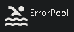
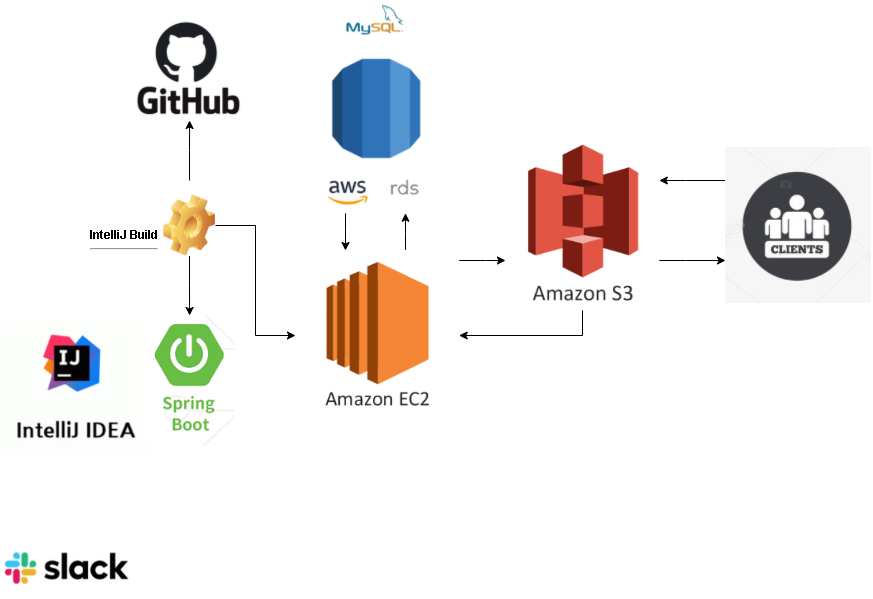
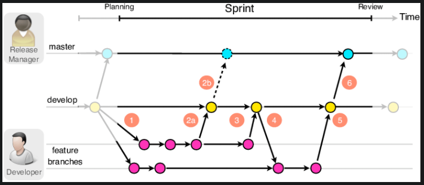
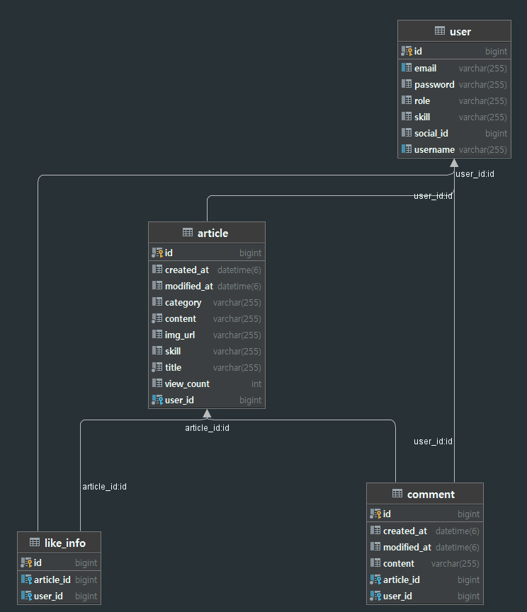

# ErrorPool

## 프로젝트 소개



> **개발자들을 위한 커뮤니티**

- 개발자들을 위한 커뮤니티로서 여러 이슈들을 공유하는 커뮤니티입니다.

- 주특기 별 게시판으로 보다 편리하게 본인에게 맞는 정보를 검색할 수 있습니다.


#### &#128198;**프로젝트 기간**

2021년 10월 11일 ~ 2021년 10월 16일

#### 👥개발인원

- **이정인**(Spring)
- **김혜림**(Spring)
- **이재성**(Spring)

## 프로젝트 구조




## 사용 기술 및 환경

#### 🛠기술스텍

- Spring
  - Java 8 
  - SpringBoot 2.5.2
  - Gradle 7.0.2
  - JPA
  - MySQL 8.0
  - H2 Database (for test)

- AWS EC2 (ubuntu 18.04 LTS)

- AWS RDS (MySQL 8.0)

  

## 프로젝트의 주요 관심사 

#### 📋공통사항

- 객체 지향적인 프로그래밍
- 지속적인 성능 개선을 위해 노력
- 리팩토링


#### 📊성능 최적화

- 쿼리 최적화

  - JPA의 N+1 문제로 인하여 조회되는 게시글 건 수 만큼 다량의 쿼리 발생
    - fech join을 통해 쿼리 수 감소
  
  ```java
  @EntityGraph(attributePaths = {"likes"})
      @Query("select distinct a from Article a " +
              "where a.skill = :skill " +
              "and a.category = :category " +
              "order by a.createdAt desc")
      Page<Article> findAllBySkillAndCategory(Pageable pageable, Skill skill, Category category);
  ```
  
  - Page를 사용하여 fetch join을 못하게 됨
  
    - batch size를 수정하여 쿼리 수 감소
  
    ```java
    @BatchSize(size = 20)
        @JsonIgnore
        @OneToMany(mappedBy = "article", cascade = CascadeType.ALL)
        private List<Comment> comments = new ArrayList<>();
    
        @BatchSize(size = 20)
        @JsonIgnore
        @OneToMany(mappedBy = "article", cascade = CascadeType.ALL)
        private List<LikeInfo> likes = new ArrayList<>();
    ```
  
    


#### 🧯에러

- SpringBoot의 logback 을 이용하여 배포 중 info 로그와 error 로그를 따로 로깅해 가시성 높임 

- MVC 테스트를 통해 배포 전 Server의 기능을 점검 


## 브랜치 관리 및 커뮤니케이션 전략

#### Git Flow 



- main, feature branch를 사용하여 main에서는 release 버전만 사용함
- feature branch는 개인당 2개씩 이용하여 한곳은 main merge 후 기본 CRUD를 탄탄히 다지기 위해 진행
- 나머지 한곳은 main merge 추가 기능을 위해 실험적 개발을 진행


#### Slack

- Back과 Front가 원활히 소통, 정보를 공유하기위해 하루 오전 9시, 오후 9시 두번 회의
- 에러를 공유하며 Back, Front 구분없이 같이 해결하여 에러잡는 시간을 단축
- 실시간 진행사항을 공유하여 서로 다른 개발방향을 가지지 않도록 함 


## DB ERD




